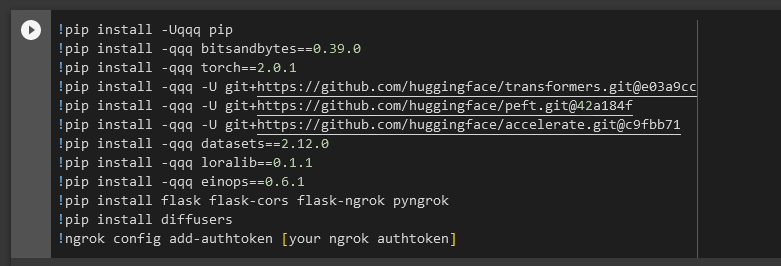
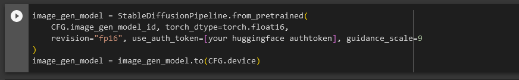

# flipfashion. - AI-Powered Fashion Assistant

Welcome to FlipFashion! I can bet that you've face a problem when it comes to choosing your outfit. Our project combines AI innovation with fashion to provide personalized outfit suggestions with up to date fashion trends and generate stunning outfit images making your job as easy as asking your mom!


## Team Members

- Kulmeet Singh
- Pratyush Bajaj
- Hrishabh Joshi

## Motivation

Selecting outfits for events has been a forever tedious task for all and this aims at making this easier for people from any gender, age, size, region, religion and many more. Using flipfashion you can simply go and say : "Hey, I need an outfit for holi" and lo and behold you get an outfit that is not only trendy but also suggests the accessories to go along with it.

## How to run this project:

### Software Requirements
- RASA only works Python 3.7+
- If it doesnt work in normal terminals try using an conda environment

### Hardware Requirements (Local)

- CPU: Any new chip with +2.0 GHz of computing capability
- GPU:LLM.int8(): NVIDIA Turing (RTX 20xx; T4) or Ampere GPU (RTX 30xx; A4-A100); (a GPU from 2018 or older).
- 8-bit optimizers and quantization: NVIDIA Kepler GPU or newer (>=GTX 78X).
- RAM: Minumum 24GB

### Hardware Requirements (Cloud/Colab Notebooks)

- CPU: Any new gen chip with +1.2GHz
- GPU: N/A
- RAM: +8GB

I will be explaining how to run on colab + local system:

- First install all the npm modules so that you can run the front end locally
```npm i```
- Run the frontend using:
```npm start```
- Run the backend DeepLearning models on the colab notebook, simply run all the cells. Ensure you add your hugging face authtoken and ngrok auth token as we will need it to make the server public and we can use them through our local frontend. Ensure you are connected to a GPU based runtime.



- After all the cells are up and running you will get a ngrok link which will look something like this:
```http://61b0-35-238-99-204.ngrok-free.app```
  copy this and change the the links in bot.js and change the links to ```[your ngrok generated link]/get_image``` and ```[your ngrok generated url]/get_falcon_response```

- You also need to run server for rasa, you can do that by simply doing cd into rasa_fashion_model and running the command ```rasa run --enable-api -m rasa run --enable-api -m 20230820-145032-crabby-quiver.tar.gz ```

- Now run the two flask server for starting Dialo GPT and rasa so interact with it ```python rasa.py``` && ```python chat.py``` after running it you can simply start using the efficient model of flipsmart. 


# Have fun generating endless outfits!!!


